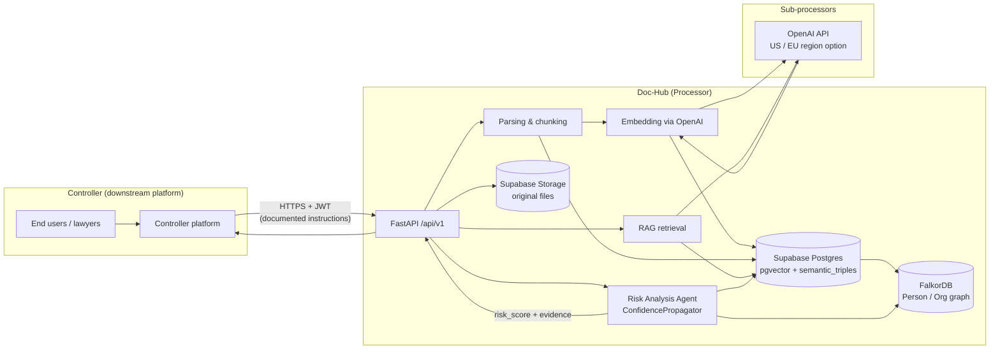

# Data Flow Mapping — Doc-Hub

**Status:** Draft v0.1  
**Last updated:** 2026-06-06

---

## 1. Inventory персональних даних

> **Processor note:** Doc-Hub обробляє дані **від імені controller**. Controller MUST мати legal basis (**Article 6**) до передачі документів у Doc-Hub.

### 1.1 User account data (дані облікового запису)

| Data element | Storage | Personal data? | Notes |
|--------------|---------|--------------|-------|
| Email, user UUID | Supabase Auth (`auth.users`) | **Так** | Controller's end-user or integrator admin |
| Display name, role metadata | Supabase / `profiles` [TBD table] | **Так** | Pilot invites, RBAC |
| JWT session | Client + Redis [TBD] | **Так** (identifier) | Short-lived |

### 1.2 Uploaded document content (вміст документів)

| Data element | Storage | Personal data? | Notes |
|--------------|---------|--------------|-------|
| Original files (PDF/DOCX) | Supabase Storage | **Так** (можливо) | Contracts: party names, executives, signatories, employee mentions |
| Parsed text chunks | `document_chunks.content` | **Так** (можливо) | Mirrors document PII |
| Chunk metadata | `document_chunks.metadata` jsonb | **Можливо** | Page, section refs |

### 1.3 Embeddings — **personal data** (EDPB Opinion 28/2024)

| Data element | Storage | Personal data? | Notes |
|--------------|---------|--------------|-------|
| Vector embeddings (1536-dim) | `document_chunks.embedding` (pgvector) | **Так** | EDPB: embeddings derived from personal data remain personal data if re-identification possible |
| Query embeddings (RAG) | Transient / logs [TBD] | **Так** | Chat queries may name persons |

**Critical requirement:** embeddings MUST participate in **cascade delete** for **Article 17** — див. [05-right-to-erasure-procedure.md](./05-right-to-erasure-procedure.md). Current FK: `document_chunks.document_id ON DELETE CASCADE` — verify embedding column cleared on chunk delete.

### 1.4 Extracted entities (knowledge graph)

| Data element | Storage | Personal data? | Notes |
|--------------|---------|--------------|-------|
| Person / Organization nodes | FalkorDB + `semantic_triples` | **Так** (often) | Subject/object strings may be natural person names |
| Relationships, evidence quotes | `semantic_triples.evidence_quote` | **Так** (можливо) | Direct quotes from contracts |
| Bitemporal validity | `valid_from`, `valid_to`, `transaction_time` [TBD migration] | Metadata | Erasure = hard delete + tombstone, not soft history with PII |

### 1.5 Chat history / queries (поведінка користувача)

| Data element | Storage | Personal data? | Notes |
|--------------|---------|--------------|-------|
| Chat queries, answers | [TBD: conversations table] / `ai_request_logs` | **Так** | `ai_request_logs`: user_id, request_type, tokens |
| Citations returned | Response payload | **Можливо** | Snippets may contain PII |

### 1.6 Audit logs (хто що переглядав)

| Data element | Storage | Personal data? | Notes |
|--------------|---------|--------------|-------|
| Access / API audit | `ai_request_logs`, app logs | **Так** | user_id, trace_id, timestamps |
| Document access trail | [TBD: Task 4 audit module] | **Так** | SOC2 vs Article 17 tension — tombstone |

---

## 2. Data flow diagram (Mermaid)

**Reference architecture:** [docs/ARCHITECTURAL_PASSPORT.md](../../ARCHITECTURAL_PASSPORT.md), [docs/architecture/02-ai-pipeline.md](../../architecture/02-ai-pipeline.md)

---

## 3. Legal bases mapping — Article 6

Controller MUST establish legal basis **before** upload. Processor acts on **Article 28(3)(a)** contract instructions.

| Data flow | Typical controller legal basis (Article 6) | Processor basis | Controller obligation |
|-----------|---------------------------------------------|-----------------|---------------------|
| Account registration | **6(1)(b)** contract with downstream | **28(3)(a)** DPA instructions | Privacy notice to users |
| Document upload for analysis | **6(1)(b)** contract / **6(1)(f)** legitimate interests (legal review) | **28(3)(a)** | Lawful collection from data subjects in documents |
| Embeddings / indexing | Same as document (derivative processing) | **28(3)(a)** | DPIA if large-scale profiling — [04-dpia](./04-dpia-risk-analysis-agent.md) |
| Knowledge graph entities | **6(1)(b)** or **6(1)(f)** | **28(3)(a)** | Notify if third-party persons extracted |
| RAG chat queries | **6(1)(b)** | **28(3)(a)** | Transparency — AI Act **Article 50** + GDPR **Article 13/14** |
| Risk Analysis Agent | **6(1)(b)** / **6(1)(f)** | **28(3)(a)** | **Article 22** safeguards — no solely automated legal decisions |
| Audit / security logs | **6(1)(f)** legitimate interests (security) | **28(3)(a)** + **32** | Retention schedule in DPA |

> **CJEU Meta C-252/21:** legitimate interests requires balancing test — controller's responsibility; Doc-Hub assists via DPIA template.

---

## 4. Special categories — Article 9

**Article 9(1):** processing special categories prohibited unless **Article 9(2)** exception applies.

| Scenario in legal documents | Examples | Doc-Hub handling |
|----------------------------|----------|------------------|
| Health data in employment contracts | Medical leave clauses | **Possible** — controller must flag; Doc-Hub does not intentionally extract health categories [TBD: classifier] |
| Religious organizations as parties | Church, foundation names | **Possible** — indirect inference |
| Trade union / political mentions | Rare in B2B contracts | **Possible** |

**Policy (proposed):**

1. **Downstream notification:** controller warrants no Article 9 data **or** has explicit **Article 9(2)** basis (often **9(2)(j)** legal claims).
2. **Flagging:** `[TBD]` `special_category_detected` signal in ingestion metadata → alert controller.
3. **Processor refusal:** Doc-Hub MAY suspend processing if controller instructs processing without Article 9 basis — DPA clause.

---

## 5. International transfers — Articles 44–49

### 5.1 OpenAI (US)

| Element | Detail |
|---------|--------|
| Transfer mechanism | **SCCs** (Module 2/3) + UK IDTA if UK controllers [TBD] |
| Supplementary measures | TLS 1.2+ in transit; **Zero Data Retention** / no training on customer data (contractual); encryption at rest on Doc-Hub side |
| EDPB Recommendations 01/2020 | Transfer impact assessment (TIA) — [TBD: publish summary] |
| **EU data residency** | OpenAI EU deployment option — **enable when controller requires** [TBD: config flag] |

### 5.2 Other subprocessors

| Sub-processor | Location | Mechanism |
|---------------|----------|-----------|
| Supabase | EU region (Frankfurt / [TBD]) | No third-country transfer if EU-only project |
| FalkorDB | EU (self-hosted / managed) | EU |
| Render | EU or US — **per deployment** | SCCs if US |
| Redis (Upstash) | [TBD region] | SCCs if non-EEA |

**Article 49 derogation:** not used for systematic transfers — SCCs primary.

---

## 6. Sub-processors registry (publication)

**Proposed URL:** `https://[TBD: dochub domain]/legal/subprocessors`

**Publication requirements:**

- **Article 28(2)** + **28(4)** — prior authorization / change notification (30 days in [03-dpa-template.md](./03-dpa-template.md))
- List: name, processing purpose, location, SCC link
- Changelog with effective dates
- Email notice to controller admins on updates

**Current Annex:** 5 subprocessors — [03-dpa-template.md §5](./03-dpa-template.md)

---

## 7. Cross-references

| Topic | Document |
|-------|----------|
| AI Act classification | [../ai-act/01-classification-analysis.md](../ai-act/01-classification-analysis.md) |
| Human oversight | [../ai-act/03-human-oversight-mechanism.md](../ai-act/03-human-oversight-mechanism.md) |
| Erasure | [05-right-to-erasure-procedure.md](./05-right-to-erasure-procedure.md) |
| RoPA | [02-records-of-processing-activities.md](./02-records-of-processing-activities.md) |

---

← Back to [README](./README.md)
