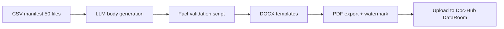

# Demo Dataset Spec — Lumino Analytics Acquisition

> **Status:** Blueprint only — PDF/DOCX generation is a separate step.  
> **Watermark (all generated files):** `DEMO DATASET — NOT REAL — Doc-Hub Sales Demo` (footer, 8pt gray, every page).

---

## Table of Contents

1. [Огляд кейсу](#1-огляд-кейсу)
2. [Розподіл 50 документів](#2-розподіл-50-документів)
3. [Спроєктовані конфлікти](#3-спроєктовані-конфлікти)
4. [Multi-hop demo script](#4-multi-hop-demo-script)
5. [Naming convention](#5-naming-convention)
6. [Privacy & legal](#6-privacy--legal)
7. [План генерації](#7-план-генерації)

---

## 1. Огляд кейсу

### Сторони угоди

| Роль | Сторона | Опис |
|------|---------|------|
| **Acquirer (Покупець)** | NorthBay Capital Holdings, LLC | Enterprise holding company ($12B AUM), diversifying into analytics SaaS |
| **Target (Ціль)** | Lumino Analytics Inc. | B2B SaaS analytics platform, ~85 FTE, Delaware C-Corp, HQ San Francisco |
| **Enterprise value** | **$30.0M** | Cash + stock mix; implied ~4.2× ARR |
| **Structure** | Stock purchase | 100% of outstanding shares; ESOP cash-out at close |

### Сценарій

NorthBay підписала **Letter of Intent (LOI)** 15 жовтня 2025 на придбання Lumino за $30M enterprise value. Угода передбачає $24M cash at close, $4M escrow (18 міс., indemnity), $2M earn-out (ARR milestones 2026). Закриття заплановано на **Q1 2026**, якщо due diligence чиста.

**Stage зараз:** LOI signed → exclusive diligence → **Q4 2025** (8-тижневий DataRoom review).

**Чому угода:** Lumino дає NorthBay embedded analytics для portfolio companies; cross-sell у 40+ B2B holdings. Ризики: customer concentration, IP chain, key-person retention, change-of-control у top MSAs.

### Учасники diligence

| Команда | Організація | Фокус |
|---------|-------------|-------|
| NorthBay Legal | In-house M&A counsel (3 lawyers) | CoC clauses, reps & warranties, disclosure schedules |
| Lumino Legal | Outside counsel (Morrison & Hale LLP) | DataRoom completeness, redactions |
| Financial DD | Deloitte | ARR bridge, cap table, working capital |
| Tax | PwC | Nexus, transfer pricing, transaction tax |
| Tech / IP | KPMG Cyber + IP sub-group | OSS compliance, patent chain, SOC2 |

### Demo narrative (3 product features)

1. **Citation search** — «What is Acme's change-of-control requirement?» → instant § cite.
2. **Conflict detection** — «Flag contradictions on CoC across MSAs» → CONFLICT-01/02 surfaced.
3. **Multi-hop reasoning** — «Top-5 clients + CoC + ARR at risk» → 3 documents chained answer.

---

## 2. Розподіл 50 документів

### Summary table

| Категорія | К-сть | Приклади імен файлів |
|---|---|---|
| Corporate / Governance | 6 | `Articles_of_Incorporation_Lumino.pdf`, `Board_Resolution_2024_03.pdf`, … |
| Material Contracts (clients) | 10 | `MSA_Acme_Corp_2023.pdf`, `SOW_BetaCo_2024.pdf`, … |
| Material Contracts (vendors) | 5 | `AWS_Enterprise_Agreement_2024.pdf`, … |
| IP & Licenses | 6 | `Patent_US10234567_Assignment.pdf`, `OSS_License_Inventory_2024.pdf`, … |
| Employment & HR | 6 | `CEO_Employment_Agreement.pdf`, `Non_Compete_Senior_Eng_2022.pdf`, … |
| Financials | 4 | `Audited_Financials_2023.pdf`, `Cap_Table_2024_Q3.pdf`, … |
| Litigation & Compliance | 4 | `GDPR_Compliance_Report_2024.pdf`, `Pending_Litigation_Disclosure.pdf`, … |
| Real Estate & Leases | 3 | `Office_Lease_SF_2022.pdf`, … |
| Tax | 3 | `Tax_Returns_2023.pdf`, `Transfer_Pricing_Memo_2023.pdf`, … |
| Insurance | 3 | `DnO_Insurance_Policy_2024.pdf`, `Cyber_Liability_Cert_2024.pdf`, … |
| **Разом** | **50** | |

---

### 2.1 Corporate / Governance (6)

| # | Filename | Ключові факти (must appear in body) |
|---|----------|-------------------------------------|
| 1 | `Articles_of_Incorporation_Lumino.pdf` | Delaware C-Corp; authorized 20M common / 5M preferred; purpose includes «data analytics software»; registered agent Wilmington |
| 2 | `Bylaws_Lumino_Amended_2023.pdf` | Board 5 seats; CEO + 4 directors; quorum 3; written consent permitted; indemnification of officers |
| 3 | `Board_Resolution_2024_03.pdf` | Resolves Series B recap; approves MSA with Zeta Enterprise; authorizes CEO to negotiate «strategic transactions» up to $50M |
| 4 | `Shareholder_Agreement_Founders_2019.pdf` | Founders Sarah Chen + Marcus Webb; drag-along if >66% preferred; tag-along rights; ROFR on share transfers |
| 5 | `Stock_Purchase_Agreement_Series_B_2022.pdf` | $8M raised at $22M pre; NorthStar Ventures lead; 1× non-participating liquidation preference; board seat to lead |
| 6 | `Certificate_of_Good_Standing_DE_2025.pdf` | Lumino Analytics Inc.; status Good Standing as of 2025-09-01; franchise taxes paid |

---

### 2.2 Material Contracts — Clients (10)

| # | Filename | Ключові факти |
|---|----------|---------------|
| 7 | `MSA_Acme_Corp_2023.pdf` | **§8.3:** change-of-control requires **prior written consent** of Acme; 30-day notice; ARR **$1.8M**; term to 2026-12-31 |
| 8 | `SOW_Acme_Corp_2024.pdf` | Implementation SOW $240K; references MSA; deliverables: 12 dashboards; go-live 2024-06-01 |
| 9 | `MSA_BetaCo_2022.pdf` | **§7.1:** assignment permitted to **successor in interest** without consent if creditworthy; ARR **$950K** |
| 10 | `MSA_Gamma_Inc_2024.pdf` | **§9.2:** CoC = **automatic termination** unless acquirer assumes obligations within 60 days; ARR **$1.4M** |
| 11 | `MSA_Delta_LLC_2023.pdf` | **§6.4:** CoC requires **client consent**; liquidated damages $500K if breached; ARR **$1.0M** |
| 12 | `SOW_Gamma_Inc_2025.pdf` | Phase 2 expansion $180K; SLA 99.5% uptime; penalty credits 10% monthly fee |
| 13 | `MSA_Epsilon_Partners_2021.pdf` | ARR **$620K**; auto-renew 12 mo; **§5.8:** silent on change-of-control (no explicit clause) |
| 14 | `DPA_Epsilon_Partners_2022.pdf` | GDPR DPA; **retention: 24 months** post-termination; sub-processors listed (AWS, Snowflake) |
| 15 | `MSA_Zeta_Enterprise_2024.pdf` | Enterprise tier ARR **$2.1M**; **§11.2:** CoC consent required; most-favored pricing clause |
| 16 | `Renewal_Notice_Acme_Corp_2025.pdf` | Acme confirms renewal intent 2026; notes «pending review of any ownership change» |

**Revenue concentration (for multi-hop):** Top 5 by ARR = Zeta ($2.1M), Acme ($1.8M), Gamma ($1.4M), Delta ($1.0M), Beta ($950K). Total **$7.25M** of **$7.1M recognized revenue** in FY2023 audit (Zeta signed mid-2024 — use projections for 2024 ARR bridge).

---

### 2.3 Material Contracts — Vendors (5)

| # | Filename | Ключові факти |
|---|----------|---------------|
| 17 | `AWS_Enterprise_Agreement_2024.pdf` | $42K/mo commit; **§14:** assignment to acquirer allowed with 45-day notice; data export SLA 72h |
| 18 | `MSA_Salesforce_2023.pdf` | CRM 150 seats; renewal 2025-11-01; termination for convenience 90-day notice |
| 19 | `Vendor_Agreement_Stripe_2022.pdf` | Payment processing; PCI DSS shared responsibility; fee 2.9% + $0.30 |
| 20 | `SOC2_Audit_Vendor_Contract_2024.pdf` | Presidio Assurance LLP; Type II audit scope Lumino production; annual fee $85K |
| 21 | `Subprocessor_Addendum_Snowflake_2024.pdf` | Data warehouse; EU-US DPF reliance; breach notification 48h |

---

### 2.4 IP & Licenses (6)

| # | Filename | Ключові факти |
|---|----------|---------------|
| 22 | `Patent_US10234567_Assignment.pdf` | Patent «Real-time cohort analytics pipeline»; assigned Lumino ← Chen & Webb 2020-04-15; USPTO recorded |
| 23 | `Trademark_LUMINO_Registration.pdf` | US Reg. #6,234,567; Class 42; first use 2018-03-01; no pending oppositions |
| 24 | `Founder_IP_Assignment_Sarah_Chen.pdf` | Assigns all pre-incorp IP; **signature block present**; effective 2019-01-10 |
| 25 | `Founder_IP_Assignment_Marcus_Webb.pdf` | Same scope as Chen; **signature line BLANK — not executed**; draft watermark «PENDING» |
| 26 | `OSS_License_Inventory_2024.pdf` | 47 OSS packages; **3 GPL-3.0** (charting libs) flagged «copyleft review required»; Apache/MIT majority |
| 27 | `Software_License_Inbound_Tableau_2023.pdf` | OEM embed license; non-transferable without Tableau consent; expires 2025-12-31 |

---

### 2.5 Employment & HR (6)

| # | Filename | Ключові факти |
|---|----------|---------------|
| 28 | `CEO_Employment_Agreement.pdf` | Sarah Chen; base $320K; target bonus 40%; **§7:** 12-mo non-compete US-wide; **§9:** single-trigger acceleration 50% on CoC |
| 29 | `CFO_Employment_Agreement_2021.pdf` | David Okonkwo; base $275K; **§6:** 6-mo non-solicit of employees only (no non-compete) |
| 30 | `Non_Compete_Senior_Eng_2022.pdf` | Template: **24-mo non-compete**, California employees **void where prohibited** (Cal. Bus. & Prof. Code §16600) |
| 31 | `ESOP_Plan_2020.pdf` | **4-year vest**, **1-year cliff**; 1,200,000 shares reserved; acceleration on CoC per board discretion |
| 32 | `Offer_Letter_Senior_Eng_2024.pdf` | Employee: **James Rivera**, SF; **3-year vest, 6-month cliff** (conflicts with ESOP); $185K base |
| 33 | `Employee_Handbook_2024.pdf` | At-will employment; remote-first; **§4.2:** non-compete «applies per individual agreements»; whistleblower hotline |

---

### 2.6 Financials (4)

| # | Filename | Ключові факти |
|---|----------|---------------|
| 34 | `Audited_Financials_2023.pdf` | Revenue **$7.1M**; gross margin 78%; net loss $(1.2M); going concern note absent; Deloitte opinion unqualified |
| 35 | `Cap_Table_2024_Q3.pdf` | Founders 38%; Series B 34%; ESOP pool 12%; angels 16%; **fully diluted 11.2M shares** |
| 36 | `Revenue_Breakdown_2024.pdf` | By customer: Zeta 28%, Acme 24%, Gamma 19%, Delta 14%, Beta 13%; other 2% |
| 37 | `Management_Financial_Projections_2025.pdf` | ARR target $9.5M; headcount 110 by EOY; assumes **no customer churn from M&A** (management assumption) |

---

### 2.7 Litigation & Compliance (4)

| # | Filename | Ключові факти |
|---|----------|---------------|
| 38 | `GDPR_Compliance_Report_2024.pdf` | 3 EU customers; DPA inventory complete; **retention standard: 36 months** for analytics logs (internal policy) |
| 39 | `Pending_Litigation_Disclosure.pdf` | **Helix Data LLC v. Lumino** — trade secret misappropriation; claimed damages **$2.3M**; discovery phase; SF Superior Court |
| 40 | `Privacy_Policy_Public_2024.pdf` | Public-facing; **retention: 12 months** after account closure; differs from GDPR report |
| 41 | `SOC2_Type2_Report_2024.pdf` | Clean opinion; 0 exceptions; period Jan–Dec 2024; maps to Trust Services Criteria |

---

### 2.8 Real Estate & Leases (3)

| # | Filename | Ключові факти |
|---|----------|---------------|
| 42 | `Office_Lease_SF_2022.pdf` | 12,400 sq ft SoMa; **$62/sq ft/yr**; term to 2027-06-30; **§19:** assignment requires landlord consent |
| 43 | `Sublease_Agreement_Palo_Alto_2023.pdf` | 2,800 sq ft; expires 2025-12-31; early termination penalty $180K |
| 44 | `Remote_Work_Policy_2024.pdf` | 70% remote workforce; **$500/mo stipend**; no mandatory office days; 12 states with W-2 employees |

---

### 2.9 Tax (3)

| # | Filename | Ключові факти |
|---|----------|---------------|
| 45 | `Tax_Returns_2023.pdf` | Federal 1120; NOL carryforward **$3.4M**; R&D credit claimed $410K; EIN REDACTED-001 |
| 46 | `Transfer_Pricing_Memo_2023.pdf` | Intercompany SaaS licensing Lumino → Lumino Analytics Ireland Ltd.; arm's length 5% royalty |
| 47 | `State_Nexus_Analysis_2024.pdf` | Nexus in CA, NY, TX, WA, CO; estimated annual state exposure **$890K** if nexus rules tighten |

---

### 2.10 Insurance (3)

| # | Filename | Ключові факти |
|---|----------|---------------|
| 48 | `DnO_Insurance_Policy_2024.pdf` | Limit **$10M**; retention $250K; **§4.2:** claims from «change of control transactions» covered if noticed within 90 days |
| 49 | `Cyber_Liability_Cert_2024.pdf` | Limit $5M; covers breach response; excludes **pending litigation** (Helix matter excluded endorsement) |
| 50 | `EPLI_Policy_2024.pdf` | Employment practices liability $3M; includes wrongful termination; retro date 2019-01-01 |

---

## 3. Спроєктовані конфлікти

> Кожен конфлікт має бути detectable через Doc-Hub citation + conflict engine.  
> Demo flow: run disclosure schedule review → product surfaces CONFLICT-ID.

### CONFLICT-01 — Change-of-control: consent vs auto-assign

| Поле | Значення |
|---|---|
| **ID** | CONFLICT-01 |
| **Документи** | `MSA_Acme_Corp_2023.pdf` **§8.3** vs `MSA_BetaCo_2022.pdf` **§7.1** |
| **Тема** | Change-of-control clause inconsistency across tier-1 clients |
| **Опис** | Acme MSA вимагає **prior written consent** покупця; BetaCo MSA дозволяє **automatic assignment** to successor without consent. Однаковий тип угоди (MSA), протилежні CoC regimes — ускладнює unified closing strategy. |
| **Бізнес-impact** | Acme = $1.8M ARR at risk; delay close 30–90 days for consent chase; possible termination if NorthBay refuses reps |
| **Демо-питання** | *"Are there any contracts that restrict our acquisition?"* |

---

### CONFLICT-02 — Change-of-control: consent vs termination trigger

| Поле | Значення |
|---|---|
| **ID** | CONFLICT-02 |
| **Документи** | `MSA_Delta_LLC_2023.pdf` **§6.4** vs `MSA_Gamma_Inc_2024.pdf` **§9.2** |
| **Тема** | CoC remedies differ (consent + LD vs auto-terminate) |
| **Опис** | Delta: consent required + **$500K liquidated damages** if CoC without consent. Gamma: agreement **terminates automatically** on CoC unless acquirer assumes within 60 days. |
| **Бізнес-impact** | Combined **$2.4M ARR**; Gamma may churn if assumption paperwork late; Delta penalty hits purchase price adjustment |
| **Демо-питання** | *"Which customer contracts terminate on change of control?"* |

---

### CONFLICT-03 — ESOP vesting cliff mismatch

| Поле | Значення |
|---|---|
| **ID** | CONFLICT-03 |
| **Документи** | `ESOP_Plan_2020.pdf` **§5.2** vs `Offer_Letter_Senior_Eng_2024.pdf` **Compensation §2** |
| **Тема** | Equity vesting schedule inconsistency |
| **Опис** | ESOP Plan: **4-year vest / 1-year cliff** for all participants. Offer letter (James Rivera): **3-year vest / 6-month cliff** — supersedes plan language in offer «to the extent more favorable». |
| **Бізнес-impact** | ~45,000 extra shares accelerate on close; **~$400K** dilution if uncorrected; rep & warranty breach risk |
| **Демо-питання** | *"Are there any equity grants that don't match the ESOP plan?"* |

---

### CONFLICT-04 — Founder IP assignment incomplete

| Поле | Значення |
|---|---|
| **ID** | CONFLICT-04 |
| **Документи** | `Founder_IP_Assignment_Sarah_Chen.pdf` **§2** vs `Founder_IP_Assignment_Marcus_Webb.pdf` **Signature page** |
| **Тема** | IP chain of title — missing execution |
| **Опис** | Chen assignment fully executed 2019. Webb assignment identical scope but **unsigned**; patent `US10234567` lists Webb as co-inventor. |
| **Бізнес-impact** | Title defect on core patent; Helix litigation leverage; may block IP rep in SPA |
| **Демо-питання** | *"Is all founder IP properly assigned to the company?"* |

---

### CONFLICT-05 — GDPR retention: DPA vs Privacy Policy vs internal report

| Поле | Значення |
|---|---|
| **ID** | CONFLICT-05 |
| **Документи** | `DPA_Epsilon_Partners_2022.pdf` **§4.1** vs `Privacy_Policy_Public_2024.pdf` **§6** vs `GDPR_Compliance_Report_2024.pdf` **§3.4** |
| **Тема** | Data retention period triangulation |
| **Опис** | DPA (Epsilon): **24 months** post-termination. Public Privacy Policy: **12 months** after account closure. Internal GDPR report: **36 months** analytics log retention. |
| **Бізнес-impact** | Regulatory exposure EU; customer notification obligation; due diligence red flag for privacy counsel |
| **Демо-питання** | *"What are our data retention obligations and are they consistent?"* |

---

### CONFLICT-06 — Non-compete vs role vs California law

| Поле | Значення |
|---|---|
| **ID** | CONFLICT-06 |
| **Документи** | `Non_Compete_Senior_Eng_2022.pdf` **§3** vs `Offer_Letter_Senior_Eng_2024.pdf` **Exhibit B** vs `Employee_Handbook_2024.pdf` **§4.2** |
| **Тема** | Non-compete enforceability vs actual restrictions |
| **Опис** | Template non-compete: **24 months**, all US. Offer letter (Rivera, SF): incorporates template. Handbook: «California employees exempt per §16600» — but offer does not carve out CA. Rivera manages **Acme + Gamma** accounts ($3.2M ARR). |
| **Бізнес-impact** | Retention risk if non-compete unenforceable post-close; key account manager may join competitor |
| **Демо-питання** | *"Which key employees have non-competes and are they enforceable in California?"* |

---

## 4. Multi-hop demo script

> Sales engineer: read **Питання** aloud → show hops in Doc-Hub → verify **Очікувана відповідь**.

---

### HOP-01 — Top clients + CoC + ARR at risk

| Поле | Значення |
|---|---|
| **Питання** | *"Which of our top-5 clients have change-of-control clauses, and what is the combined ARR at risk?"* |
| **Hop 1** | `Revenue_Breakdown_2024.pdf` + `Cap_Table_2024_Q3.pdf` → identify top 5: Zeta, Acme, Gamma, Delta, Beta |
| **Hop 2** | Each `MSA_*.pdf` → extract CoC section (consent / terminate / silent) |
| **Hop 3** | Sum ARR from MSAs for clients **with restrictive CoC** (consent or terminate) |
| **Очікувана відповідь** | **4 of 5** have explicit CoC clauses (all except Epsilon — not in top 5). Restrictive: **Zeta, Acme, Gamma, Delta** = **$6.3M ARR**. Beta auto-assigns (lower risk). *Optional strict answer if demo uses FY2023 audit only:* **3 of 5** (Acme, Gamma, Delta) = **$4.2M** — use when excluding Zeta (2024 contract). |
| **Документи у відповіді** | `MSA_Acme_Corp_2023.pdf`, `MSA_Gamma_Inc_2024.pdf`, `MSA_Delta_LLC_2023.pdf`, `MSA_Zeta_Enterprise_2024.pdf`, `Revenue_Breakdown_2024.pdf`, `Audited_Financials_2023.pdf` |

---

### HOP-02 — IP ownership chain → litigation exposure

| Поле | Значення |
|---|---|
| **Питання** | *"Do we have clean title to the patent Helix is suing over, and who invented it?"* |
| **Hop 1** | `Pending_Litigation_Disclosure.pdf` → Helix claims trade secrets in **cohort analytics pipeline** |
| **Hop 2** | `Patent_US10234567_Assignment.pdf` → same pipeline patented; inventors Chen + Webb |
| **Hop 3** | `Founder_IP_Assignment_Sarah_Chen.pdf` + `Founder_IP_Assignment_Marcus_Webb.pdf` → Chen assigned; **Webb unsigned** |
| **Очікувана відповідь** | Patent recorded to Lumino, but **Webb IP assignment missing signature** — title gap. Helix damages claimed **$2.3M**. Cyber policy **excludes** pending litigation. |
| **Документи у відповіді** | `Pending_Litigation_Disclosure.pdf`, `Patent_US10234567_Assignment.pdf`, `Founder_IP_Assignment_Marcus_Webb.pdf`, `Cyber_Liability_Cert_2024.pdf` |

---

### HOP-03 — Employee retention + non-compete + managed ARR

| Поле | Значення |
|---|---|
| **Питання** | *"Who manages our largest accounts, and can we enforce non-competes if they leave after close?"* |
| **Hop 1** | `Revenue_Breakdown_2024.pdf` → top clients Zeta, Acme, Gamma |
| **Hop 2** | `Offer_Letter_Senior_Eng_2024.pdf` → James Rivera, **Account Director**, owns Acme + Gamma relationships (named in SOW_Gamma) |
| **Hop 3** | `Non_Compete_Senior_Eng_2022.pdf` + `Employee_Handbook_2024.pdf` → 24-mo non-compete **likely unenforceable in CA** |
| **Очікувана відповідь** | **James Rivera** manages **~$3.2M ARR** (Acme + Gamma). Non-compete **not reliably enforceable** in California; recommend retention bonus / stay bonus for close. |
| **Документи у відповіді** | `Offer_Letter_Senior_Eng_2024.pdf`, `MSA_Acme_Corp_2023.pdf`, `SOW_Gamma_Inc_2025.pdf`, `Non_Compete_Senior_Eng_2022.pdf`, `Employee_Handbook_2024.pdf` |

---

### HOP-04 — Tax exposure × litigation jurisdiction

| Поле | Значення |
|---|---|
| **Питання** | *"What is our total tax and legal exposure from the Helix case in California?"* |
| **Hop 1** | `Pending_Litigation_Disclosure.pdf` → **$2.3M** claim; SF Superior Court (CA) |
| **Hop 2** | `State_Nexus_Analysis_2024.pdf` → CA nexus confirmed; incremental exposure **$890K** if audit adjustments |
| **Hop 3** | `Tax_Returns_2023.pdf` → NOL **$3.4M** (may offset judgment income tax impact) |
| **Очікувана відповідь** | Legal claim **$2.3M** (CA court). State tax nexus risk **$890K** separate. NOL may reduce tax hit on any settlement income — **net legal exposure primary concern $2.3M**; D&O may respond if noticed within 90 days post-close. |
| **Документи у відповіді** | `Pending_Litigation_Disclosure.pdf`, `State_Nexus_Analysis_2024.pdf`, `Tax_Returns_2023.pdf`, `DnO_Insurance_Policy_2024.pdf` |

---

### HOP-05 — Real estate burn vs remote policy vs headcount plan

| Поле | Значення |
|---|---|
| **Питання** | *"If we cut office space 50% post-acquisition, what are our lease obligations vs remote stipends at 110 headcount?"* |
| **Hop 1** | `Management_Financial_Projections_2025.pdf` → **110 FTE** plan |
| **Hop 2** | `Remote_Work_Policy_2024.pdf` → **$500/mo × remote employees** (70% of 85 current = ~$30K/mo) |
| **Hop 3** | `Office_Lease_SF_2022.pdf` + `Sublease_Agreement_Palo_Alto_2023.pdf` → combined **~$92K/mo** lease; PA sublease penalty **$180K** if exited early |
| **Очікувана відповідь** | Current lease **~$1.1M/yr** + sublease penalty risk **$180K**. Remote stipends at 110 FTE (~77 remote): **~$462K/yr**. 50% space reduction saves **~$550K/yr** lease but requires landlord consent (`Office_Lease_SF_2022.pdf` §19). |
| **Дocumentи у відповіді** | `Office_Lease_SF_2022.pdf`, `Sublease_Agreement_Palo_Alto_2023.pdf`, `Remote_Work_Policy_2024.pdf`, `Management_Financial_Projections_2025.pdf` |

---

### HOP-06 — Disclosure schedule completeness (CoC)

| Поле | Значення |
|---|---|
| **Питання** | *"List every customer contract requiring consent before we can close the NorthBay acquisition."* |
| **Hop 1** | Scan all `MSA_*.pdf` for change-of-control / assignment clauses |
| **Hop 2** | Cross-check `Renewal_Notice_Acme_Corp_2025.pdf` for Acme's informal flag on ownership change |
| **Hop 3** | Exclude vendor MSAs (`AWS`, `Salesforce`) — not customer revenue |
| **Очікувана відповідь** | **Consent required:** Acme (§8.3), Delta (§6.4), Zeta (§11.2). **Termination unless assumed:** Gamma (§9.2). **Auto-assign:** Beta (§7.1). **Silent:** Epsilon (§5.8). **Total customer ARR needing consent: $4.6M** (Acme + Delta + Zeta). |
| **Документи у відповіді** | `MSA_Acme_Corp_2023.pdf`, `MSA_Delta_LLC_2023.pdf`, `MSA_Zeta_Enterprise_2024.pdf`, `MSA_Gamma_Inc_2024.pdf`, `MSA_BetaCo_2022.pdf`, `Renewal_Notice_Acme_Corp_2025.pdf` |

---

### Quick citation demos (single-hop, 30 sec each)

| # | Demo question | Expected cite |
|---|---------------|---------------|
| C-1 | *"What is Acme's change-of-control clause?"* | `MSA_Acme_Corp_2023.pdf` §8.3 |
| C-2 | *"What damages does Helix claim?"* | `Pending_Litigation_Disclosure.pdf` p.2 |
| C-3 | *"What is the CEO's non-compete period?"* | `CEO_Employment_Agreement.pdf` §7 |

---

## 5. Naming convention

### Format

```
{Type}_{Counterparty}_{YYYY[_MM]}.{ext}
```

| Segment | Rules | Examples |
|---------|-------|----------|
| **Type** | PascalCase or UPPER acronym | `MSA`, `SOW`, `DPA`, `Patent`, `Tax_Returns` |
| **Counterparty** | Optional; PascalCase, no spaces | `Acme_Corp`, `Gamma_Inc`, omit for internal docs |
| **Date** | `YYYY` or `YYYY_MM` | `2023`, `2024_03` |
| **ext** | `.pdf` (primary); `.docx` only if editable source needed | `.pdf` |

### Additional rules

- Lumino-internal docs: prefix `Lumino` only when disambiguation needed (`Articles_of_Incorporation_Lumino.pdf`).
- Board / governance: `{Body}_{Entity}_{YYYY_MM}.pdf` → `Board_Resolution_2024_03.pdf`.
- No spaces, no special chars except `_` and `.`.
- Version suffix **not used** — date encodes revision.
- All dates **2018-01-01 … 2025-12-31**.

---

## 6. Privacy & legal

| Rule | Implementation |
|------|----------------|
| **Fictional parties** | All companies and persons are synthetic. No real trademarks except generic product names (AWS, Salesforce) as realistic vendor references. |
| **PII** | Names like Sarah Chen, Marcus Webb, James Rivera — fictional. Emails: `@lumino-demo.invalid`. |
| **Tax IDs** | Format `REDACTED-{N}` (e.g. EIN `REDACTED-001`, SSN `REDACTED-002`). Never use valid TIN patterns. |
| **Addresses** | Real city names OK; street addresses fictional (e.g. «1200 Market Street, Suite 400, San Francisco, CA 94103» — verify non-residential). |
| **Watermark** | Every page: `DEMO DATASET — NOT REAL` centered footer + diagonal light gray on page 1. |
| **Distribution** | Internal sales + product demo only; not for client training on real matters. |
| **Locale** | English (US legal style); currency USD. |

---

## 7. План генерації

> **Do not execute in this step** — blueprint for next prompt.

### 7.1 Faker-suitable fields

| Field | Faker provider | Example |
|-------|----------------|---------|
| Person names | `name.full()` | Officers, signatories |
| Company names (secondary) | `company.company()` | Minor customers, vendors |
| Addresses | `address.street_address()`, `city()`, `state_abbr()` | Lease, notice addresses |
| Dates (non-critical) | `date_between(start, end)` | Signature dates within range |
| Dollar amounts (non-scripted) | `pydecimal` / random in band | Minor line items, expenses |
| EIN-like redacted | `REDACTED-{random_int(1,999)}` | Tax forms |
| Phone / email | `phone_number()`, `company_email()` | Contact blocks |

**Do not Faker:** ARR figures, CoC clause text, conflict facts, multi-hop answers — these must match §2–4 exactly.

### 7.2 LLM-generated (template-guided)

| Document class | Prompt strategy |
|----------------|-----------------|
| MSAs / SOWs | Template: definitions → term → fees → **§ CoC (scripted)** → indemnity → boilerplate |
| Employment / offer letters | State-specific boilerplate + **scripted § non-compete / vesting** |
| Governance | Standard Delaware corp language + **scripted board resolutions** |
| Compliance reports | GDPR/SOC2 structure from public frameworks + **scripted retention numbers** |
| Litigation disclosure | Complaint summary paragraph + **scripted Helix damages** |

**QA gate:** automated grep for canonical facts (ARR, § refs, REDACTED-*) before PDF render.

### 7.3 Static templates (no LLM)

| Document | Approach |
|----------|----------|
| `Cap_Table_2024_Q3.pdf` | Generated from CSV template (fixed percentages) |
| `OSS_License_Inventory_2024.pdf` | Table export from curated CSV (47 rows, 3 GPL flagged) |
| `Certificate_of_GoodStanding_DE_2025.pdf` | Scanned-style template with Lumino name swap |
| `Cyber_Liability_Cert_2024.pdf` | ACORD-style form, static limits |
| Watermark layer | Python/reportlab or docx template footer |

### 7.4 Generation pipeline (recommended order)



1. Export manifest from §2 tables (filename + facts JSON).
2. Generate DOCX per category batch (contracts batch 1, HR batch 2, …).
3. Run validation: 50 unique names, all CONFLICT-IDs resolvable, all HOP answers grep-able.
4. Convert to PDF; apply watermark.
5. Ingest to demo tenant; index for RAG.

---

## Appendix — Master file list (50 unique names)

```
Articles_of_Incorporation_Lumino.pdf
Bylaws_Lumino_Amended_2023.pdf
Board_Resolution_2024_03.pdf
Shareholder_Agreement_Founders_2019.pdf
Stock_Purchase_Agreement_Series_B_2022.pdf
Certificate_of_Good_Standing_DE_2025.pdf
MSA_Acme_Corp_2023.pdf
SOW_Acme_Corp_2024.pdf
MSA_BetaCo_2022.pdf
MSA_Gamma_Inc_2024.pdf
MSA_Delta_LLC_2023.pdf
SOW_Gamma_Inc_2025.pdf
MSA_Epsilon_Partners_2021.pdf
DPA_Epsilon_Partners_2022.pdf
MSA_Zeta_Enterprise_2024.pdf
Renewal_Notice_Acme_Corp_2025.pdf
AWS_Enterprise_Agreement_2024.pdf
MSA_Salesforce_2023.pdf
Vendor_Agreement_Stripe_2022.pdf
SOC2_Audit_Vendor_Contract_2024.pdf
Subprocessor_Addendum_Snowflake_2024.pdf
Patent_US10234567_Assignment.pdf
Trademark_LUMINO_Registration.pdf
Founder_IP_Assignment_Sarah_Chen.pdf
Founder_IP_Assignment_Marcus_Webb.pdf
OSS_License_Inventory_2024.pdf
Software_License_Inbound_Tableau_2023.pdf
CEO_Employment_Agreement.pdf
CFO_Employment_Agreement_2021.pdf
Non_Compete_Senior_Eng_2022.pdf
ESOP_Plan_2020.pdf
Offer_Letter_Senior_Eng_2024.pdf
Employee_Handbook_2024.pdf
Audited_Financials_2023.pdf
Cap_Table_2024_Q3.pdf
Revenue_Breakdown_2024.pdf
Management_Financial_Projections_2025.pdf
GDPR_Compliance_Report_2024.pdf
Pending_Litigation_Disclosure.pdf
Privacy_Policy_Public_2024.pdf
SOC2_Type2_Report_2024.pdf
Office_Lease_SF_2022.pdf
Sublease_Agreement_Palo_Alto_2023.pdf
Remote_Work_Policy_2024.pdf
Tax_Returns_2023.pdf
Transfer_Pricing_Memo_2023.pdf
State_Nexus_Analysis_2024.pdf
DnO_Insurance_Policy_2024.pdf
Cyber_Liability_Cert_2024.pdf
EPLI_Policy_2024.pdf
```

---

*Document owner: Product / Sales Engineering · Doc-Hub · v1.0 · May 2026*
