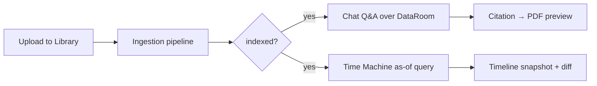

# Doc-Hub Frontend — Wireframes & Product Spec

> **Версія:** 1.0 · **Стек:** React 18, Vite, TypeScript, Tailwind CSS, Zustand, TanStack Query, lucide-react, react-hot-toast  
> **Домен:** LegalTech · M&A Due Diligence (DataRoom, сотні документів на угоду)  
> **Scope:** Desktop-first (≥1024px). Mobile — адаптивні collapse/drawer, без окремого mobile-дизайну.

---

## Table of Contents

1. [Загальні принципи](#1-загальні-принципи)
2. [Екран A: Document Library](#2-екран-a-document-library)
3. [Екран B: Chat Interface](#3-екран-b-chat-interface)
4. [Екран C: Time Machine](#4-екран-c-time-machine)
5. [Routing](#5-routing)
6. [API & State (довідник для розробника)](#6-api--state-довідник-для-розробника)
7. [Responsive breakpoints](#7-responsive-breakpoints)

---

## 1. Загальні принципи

### Layout shell

Усі три екрани рендеряться всередині існуючого `DashboardLayout`: лівий nav (280px), контентна область `flex-1 overflow-hidden`. Екрани A і B використовують **три колонки** (sidebar + main + drawer). Drawer — overlay на `<lg`, fixed panel на `≥lg`.

### Дизайн-токени (Tailwind)

| Токен | Використання |
|-------|--------------|
| `brand-500` / `brand-600` | Primary actions, active nav, progress bars |
| `surface-0` … `surface-3` | Фони карток, borders (light mode) |
| `surface-dark-0` … `surface-dark-3` | Dark mode surfaces |
| `text-gray-900` / `dark:text-white` | Primary text |
| `text-gray-400` | Secondary / meta |
| `rounded-xl`, `border border-surface-2` | Card pattern (як у `DocumentsPage`) |
| `animate-pulse-dot` | Streaming indicator (як у `ChatPage`) |

### Патерни коду (не дублювати)

- API: `api.documents.*`, `api.chat.query()`, `api.chat.stream()` з `@/lib/api`
- Auth: `useAuthStore`, `ProtectedRoute`
- Ingestion realtime: `useIngestionProgress(docId)` + WebSocket `/api/v1/documents/{id}/ingestion/ws`
- Toasts: `react-hot-toast` для success/error
- Path alias: `@/` → `src/`

### User flow (M&A)

---

## 2. Екран A: Document Library

**Route:** `/library` · **Component:** `<DocumentLibrary>` · **Auth:** required  
**Evolution:** замінює/розширює поточний `DocumentsPage` (`/documents` → redirect на `/library`).

### Призначення

Центральний DataRoom для M&A due diligence: юрист завантажує сотні контрактів (NDA, SPA, disclosure schedules, board minutes), фільтрує їх за типом і статусом індексації, відстежує прогрес pipeline і швидко відкриває preview без виходу з контексту угоди. Один workspace = одна deal room.

### Layout

**Лівий sidebar (240px, collapsible на `<lg`):**

- Заголовок «Фільтри» + кнопка «Скинути»
- **Тип документу** — multi-select chips: `NDA`, `SPA`, `Disclosure`, `Financial`, `Corporate`, `Other` (значення з `document_type` або metadata)
- **Статус ingestion** — checkbox group: `pending`, `parsing`, `chunking`, `embedding`, `indexed`, `failed`
- **Дата завантаження** — preset: «Сьогодні», «7 днів», «30 днів», «Custom range» (native date inputs)
- Лічильник: «Показано N з M»

**Головна область (flex-1):**

- Toolbar: search input (debounce 300ms, по `filename`), toggle **Grid / Table**, кнопка «Upload» (secondary), primary «Browse files»
- Upload zone (collapsible після першого upload): drag-and-drop на всю ширину toolbar або окремий banner зверху
- Content: **Table view** (default на desktop) або **Card grid** (3 cols на `xl`, 2 на `lg`, 1 на `<lg`)

**Правий drawer (420px, slide-in):**

- Відкривається при кліку на рядок/card
- Header: filename, mime icon, close `X`
- Tabs: **Preview** (PDF iframe / text fallback), **Metadata** (size, uploaded_at, chunks_count, document_type), **Actions**
- Footer actions: Re-ingest, Download (signed URL), Delete (confirm modal)

### Upload

| Елемент | Поведінка |
|---------|-----------|
| Drop zone | `react-dropzone`, border dashed `border-brand-400 bg-brand-50/50` при drag-active |
| Browse | `<input type="file" multiple>` — ті самі MIME, що в поточному `DocumentsPage` |
| Multi-file | Паралельний upload через `api.documents.upload()`; окремий progress row на файл |
| Progress | Per-file bar: `bg-brand-500` → `bg-green-500` at 100%; label «Uploading…» |
| Post-upload | Auto-trigger ingest (`api.documents.ingest(id)`); optimistic row зі статусом `pending` |
| Error | Toast + червоний bar; файл залишається в списку з `failed` |

### Grid / Table columns

| Column | Source | Notes |
|--------|--------|-------|
| Filename | `document.filename` | Truncate + tooltip повне ім'я |
| Type | `document_type` | Badge `bg-surface-1 text-gray-600` |
| Size | `size_bytes` | `formatBytes()` |
| Uploaded | `created_at` | `formatDate()`, sortable default DESC |
| Ingestion status | WS + API | Badge + optional `IngestionProgressBar` |
| Chunks | `metadata.chunks_count` або API field | `—` якщо pending |
| Actions | `…` menu | Re-ingest, Delete, Open in Chat |

### Ingestion statuses

| Status | Tailwind badge | Icon (lucide) | Progress % (WS) | Optimistic update |
|--------|----------------|---------------|-----------------|-------------------|
| `pending` | `text-gray-600 bg-gray-100` | `Clock` | 0 | Після upload — одразу `pending`, до першого WS event |
| `parsing` | `text-amber-600 bg-amber-50` | `Loader2` animate-spin | 10–30 | WS `status=parsing` перезаписує local |
| `chunking` | `text-amber-700 bg-amber-100` | `Scissors` | 30–55 | Monotonic: не відкочувати progress назад |
| `embedding` | `text-brand-700 bg-brand-50` | `Brain` або `Sparkles` | 55–90 | `bg-brand-500` на progress bar |
| `indexed` | `text-green-600 bg-green-50` | `CheckCircle2` | 100 | Terminal; invalidate `['documents']` |
| `failed` | `text-red-600 bg-red-50` | `XCircle` | any | `is_failed=true`; показати `error` label + Retry |

**Optimistic logic:**

1. Upload success → insert row з `pending`, `progress=0`
2. WS events → merge by `doc_id`; ignore stale events (progress only increases)
3. Terminal `indexed` → зелений badge, прибрати spinner
4. `failed` → червоний badge; кнопка Retry викликає `api.documents.ingest(id)` і скидає на `pending`
5. Polling fallback: `refetchInterval: 3000` поки є non-terminal docs (як у поточному `DocumentsPage`)

### Empty / Loading / Error states

| State | UI |
|-------|-----|
| **Empty** | Ілюстрація `FileText` в `bg-brand-50 rounded-2xl`, заголовок «DataRoom порожній», CTA «Завантажити перший документ», drag zone активна |
| **Loading** | Skeleton: 8 table rows (`animate-pulse bg-surface-2 h-12 rounded-lg`) |
| **Error** | Banner `bg-red-50 border-red-200`, `AlertCircle`, текст помилки API, кнопка «Повторити» → refetch |
| **Filtered empty** | «Немає документів за обраними фільтрами» + «Скинути фільтри» |

### Acceptance criteria

1. Користувач може завантажити ≥10 файлів одночасно; кожен з'являється в grid ≤2s після upload response.
2. Ingestion progress оновлюється через WebSocket без full page reload; fallback polling працює при WS disconnect.
3. Фільтри (type + status + date) комбінуються AND; URL query params (`?type=NDA&status=indexed`) для shareable view.
4. Клік на рядок відкриває drawer з preview; Esc / overlay click закриває drawer.
5. Grid/Table toggle зберігається в `localStorage` (`library-view-mode`).
6. Delete вимагає confirm modal; після delete рядок зникає без refresh.
7. На `<lg` sidebar фільтрів — slide-over; drawer preview — full-screen overlay.

---

## 3. Екран B: Chat Interface

**Route:** `/chat`, `/chat/:conversationId` · **Component:** `<ChatInterface>` · **Auth:** required

### Призначення

Юрист ставить питання по проіндексованому DataRoom («Які change-of-control обмеження в NDA Acme?», «Хто indemnifying party у §4.2 SPA?») і отримує відповіді з обов'язковими citations на конкретні сторінки/секції. Кожне твердження має traceability до source chunk — критично для legal review.

### Layout

**Лівий sidebar (260px):**

- Кнопка «+ Нова розмова»
- Список conversations: title (перше user message, truncate 40 chars), дата, message count
- Active conversation — `bg-brand-50 dark:bg-brand-900/20 border-l-2 border-brand-500`
- Search по історії (client-side filter)
- `/chat/:conversationId` — deep link; якщо ID не знайдено → toast + redirect `/chat`

**Центр (flex-1, column):**

- Header: назва розмови, badge «N docs in scope», optional document scope picker
- Messages stream: scrollable `flex-1 overflow-y-auto px-6 py-4 space-y-4`
- Input area: fixed bottom, `border-t border-surface-2`, padding `px-6 py-4`

**Правий drawer (480px):**

- Відкривається при кліку на citation chip
- Header: `[filename · p.X · §Y]`
- PDF viewer area (iframe або pdf.js) з highlight bbox chunk (yellow overlay `bg-amber-200/40`)
- Sidebar meta: snippet text, chunk_index, similarity score
- Кнопки: «Open full document» → `/library?doc={id}`, «Copy citation»

### Message types

| Type | Role | Styling | Content |
|------|------|---------|---------|
| User | `user` | `bg-brand-600 text-white rounded-2xl rounded-tr-sm`, align right | Plain text / markdown |
| Assistant | `assistant` | `bg-surface-1 dark:bg-surface-dark-2 rounded-2xl rounded-tl-sm`, align left | Markdown + citations + confidence dot |
| System | `system` | `bg-red-50 border border-red-200 text-red-700`, centered, full width | Тільки помилки (API fail, timeout, no indexed docs) |

System messages **не** використовуються для info/welcome — welcome block окремий empty state.

### Citation chips

**Format:** `[NDA_2023.pdf · p.47 · §3]` — monospace segment у chip `bg-brand-50 dark:bg-brand-900/30 text-brand-700 px-2 py-0.5 rounded-md text-xs font-mono cursor-pointer hover:bg-brand-100`.

**Hover tooltip (200ms delay):**

- Snippet: перші 200 символів chunk (`…` якщо довше)
- Similarity / score якщо є
- Кнопка «Open in viewer» → відкриває правий drawer

**Inline placement:** chips під assistant message, wrap `flex flex-wrap gap-1.5`.

### Confidence indicator

Backend field: `confidence_score` (0–1) на рівні assistant message (aggregate по facts або retrieval).

| Range | Dot class | Label (tooltip) |
|-------|-----------|-----------------|
| `< 0.5` | `bg-red-500` | «Low confidence — verify manually» |
| `0.5 – 0.8` | `bg-amber-400` | «Medium confidence» |
| `> 0.8` | `bg-green-500` | «High confidence» |

Dot: `w-2 h-2 rounded-full` поруч із timestamp assistant message. Якщо `confidence_score` відсутній — fallback на `risk_score` / `risk_level` з поточного API (map `high risk` → red dot).

### Streaming (SSE)

- Primary: `api.chat.stream(query)` — async generator, append tokens to assistant bubble
- Typing indicator: три `animate-pulse-dot` (`bg-brand-400`) поки stream active
- On complete: parse final payload для `sources`, `citations`, `confidence_score`; replace streamed text якщо backend надс надсилає canonical answer
- Error mid-stream: freeze partial text + system error «Stream interrupted»
- **Non-stream fallback:** `api.chat.query()` якщо `stream: true` не підтримується (feature flag)

### Input

| Behavior | Detail |
|----------|--------|
| Control | `<textarea>` auto-resize `min-h-[44px] max-h-[200px]` |
| Enter | Send (preventDefault) |
| Shift+Enter | Newline |
| Attachment | Paperclip icon — modal multi-select indexed docs → `document_ids[]` scope для наступного query |
| Disabled | Поки `isLoading` або `indexedDocs.length === 0` |
| Send button | `brand-600`, icon `Send`, disabled when empty |

Suggested prompts (empty state): «Summarize indemnification caps», «List material adverse change definitions», «Compare termination clauses across SPAs».

### Acceptance criteria

1. Нова розмова створюється з «+»; URL оновлюється на `/chat/:conversationId` без full reload.
2. User message з'являється instantly (optimistic); assistant stream починається ≤1s після send.
3. Citation chip click відкриває drawer з PDF preview і highlighted chunk ≤2s.
4. Tooltip на hover показує ≥1 snippet char і кнопку «Open in viewer».
5. Confidence dot відображається для кожної assistant відповіді з backend score; коректні кольори за порогами.
6. Enter надсилає; Shift+Enter — newline; поведінка стабільна при IME.
7. Attachment scope обмежує RAG до обраних `document_ids`; badge «3 docs scoped» в header.
8. System error при API 4xx/5xx — червоний banner, попередні messages збережені.
9. Conversation history persist (localStorage Phase 1; API Phase 2 — позначити TODO).
10. Markdown rendering (GFM) для assistant messages; code blocks monospace `font-mono`.

---

## 4. Екран C: Time Machine

**Route:** `/time-machine` · **Component:** `<TimeMachine>` · **Auth:** required

### Призначення

M&A-specific temporal query: «Який був стан угоди на 15 березня 2024?» — показує, які документи вже існували в DataRoom, які версії були актуальні, які зобов'язання (obligations/covenants) вважалися in force на обрану дату. Дозволяє порівняти historical snapshot з поточним станом (diff) для disclosure gap analysis.

### Layout

**Верхня панель (sticky, `border-b bg-white dark:bg-surface-dark-1 px-6 py-4`):**

- **Datepicker** (left)
- **Query input** (center, flex-1 max-w-2xl) — той самий textarea pattern що Chat
- **Search button** `brand-600` «Query as of date»
- Meta line: «Showing state as of {date} · {N} documents · {M} chunks»

**Центр — два блоки (vertical stack):**

1. **Horizontal timeline** (height ~120px): вісь часу від `earliest_doc_date` до `today`; snapshot markers на датах upload/version events
2. **Results panel:** tabbed — **Relevant chunks** (list) | **Diff vs today** (side-by-side)

### Datepicker — рішення

**Обрано: native `<input type="date">`**

| Критерій | Native | shadcn DatePicker |
|----------|--------|-------------------|
| Залежності | 0 | + Radix, date-fns, calendar UI |
| Accessibility | OS-native | Потребує wiring |
| Precision | Day-level (достатньо для legal as-of) | Day-level |
| Consistency | Вже використовується pattern Input з `@/components/ui/Input` | Новий design subsystem |

Обгортка: label «As-of date», `min={earliest_doc_date}`, `max={today}`, default `today`. Стилізація через існуючий Input class (`focus:ring-brand-400`).

### Query field

- Той самий UX що Chat input (Enter = search, Shift+Enter = newline)
- API (proposed): `POST /api/v1/chat/temporal` body `{ query, as_of_date, top_k }` або reuse `/api/v1/chat` з `as_of_date` param
- Results filtered server-side: chunks/documents де `effective_date ≤ as_of_date` і не superseded на ту дату

### Visualization

**1. Horizontal timeline**

- Scrollable container `overflow-x-auto`
- Markers: circle `w-3 h-3 rounded-full bg-brand-500` на `created_at` / version events
- Hover marker → tooltip: filename, event type (upload | re-index | superseded)
- Selected `as_of_date` — vertical line `border-l-2 border-brand-600` з label зверху
- Today — marker `bg-green-500`

**2. Diff view (tab «Diff vs today»)**

- Left column: **As of {selected_date}** — список obligations / key facts
- Right column: **Today** — поточний стан
- Added: `bg-green-50 text-green-800`
- Removed: `bg-red-50 text-red-800 line-through`
- Changed: `bg-amber-50` з inline before/after
- Якщо diff порожній: «No changes since {date}»

**Relevant chunks list:**

- Card per chunk: filename, section, snippet (3 lines), confidence badge
- Click → open citation drawer (reuse Chat drawer component)

### Edge case: date before any document

**Trigger:** `as_of_date < earliest_doc_date` (або zero documents)

**Empty state:**

- Icon `CalendarX` (lucide), `text-gray-400`
- Title: «На цю дату документів ще не було»
- Body: «Найраніший документ у DataRoom завантажено {earliest_doc_date}. Оберіть пізнішу дату.»
- CTA: кнопка «Перейти до {earliest_doc_date}» — встановлює datepicker на min date

### Acceptance criteria

1. Datepicker обмежений `[earliest_doc, today]`; default = today.
2. Query as-of повертає лише chunks/documents valid на обрану дату (server-side filter).
3. Timeline рендерить ≥1 marker per uploaded document; selected date line синхронізована з picker.
4. Diff tab показує semantic diff між as-of snapshot і today; empty diff — explicit message.
5. Edge case (date before first doc) — empty state без API error spam.
6. Chunk click відкриває preview drawer (reuse Chat citation drawer).
7. Loading: skeleton timeline + 5 chunk placeholders; error — retry banner.

---

## 5. Routing

| Route | Component | Auth required | Notes |
|-------|-----------|---------------|-------|
| `/library` | `<DocumentLibrary>` | yes | Primary DataRoom; redirect з `/documents` |
| `/chat` | `<ChatInterface>` | yes | Нова розмова |
| `/chat/:conversationId` | `<ChatInterface>` | yes | Deep link до історії |
| `/time-machine` | `<TimeMachine>` | yes | Temporal queries |

**Nav update (`DashboardLayout`):** замінити «Документи» → `/library`; додати «Time Machine» → `/time-machine`.

**Protected:** усі routes під `ProtectedRoute` + `DashboardLayout` (як поточний `App.tsx`).

---

## 6. API & State (довідник для розробника)

| Screen | API endpoints | Client state |
|--------|---------------|--------------|
| Library | `GET/POST /api/v1/documents`, `POST .../upload`, `POST .../ingest`, `DELETE .../{id}`, WS `.../ingestion/ws` | TanStack Query `['documents']`, local filters, drawer `selectedDocId` |
| Chat | `POST /api/v1/chat` (`stream: true`), future `GET/POST /api/v1/conversations` | `messages[]`, `conversationId`, `scopedDocIds[]`, drawer `activeCitation` |
| Time Machine | `POST /api/v1/chat` + `as_of_date`, future `/api/v1/temporal/snapshot` | `asOfDate`, `timelineEvents[]`, `chunks[]`, `diff` |

**Shared components to extract:**

- `<CitationDrawer>` — Chat + Time Machine
- `<IngestionStatusBadge>` — Library grid
- `<ChatInput>` — Chat + Time Machine query field

---

## 7. Responsive breakpoints

| Breakpoint | Tailwind | Behavior |
|------------|----------|----------|
| `< 640px` | default | Single column; sidebars → bottom sheet / full overlay |
| `640–1023px` | `sm`–`md` | Collapsed nav; drawer full-width |
| `≥ 1024px` | `lg+` | **Primary spec target** — three-column layouts visible |
| `≥ 1280px` | `xl` | Card grid 3 columns; wider drawer (480px) |

Focus на desktop (`lg+`): M&A юристи працюють на wide monitors з dual PDF + chat.
